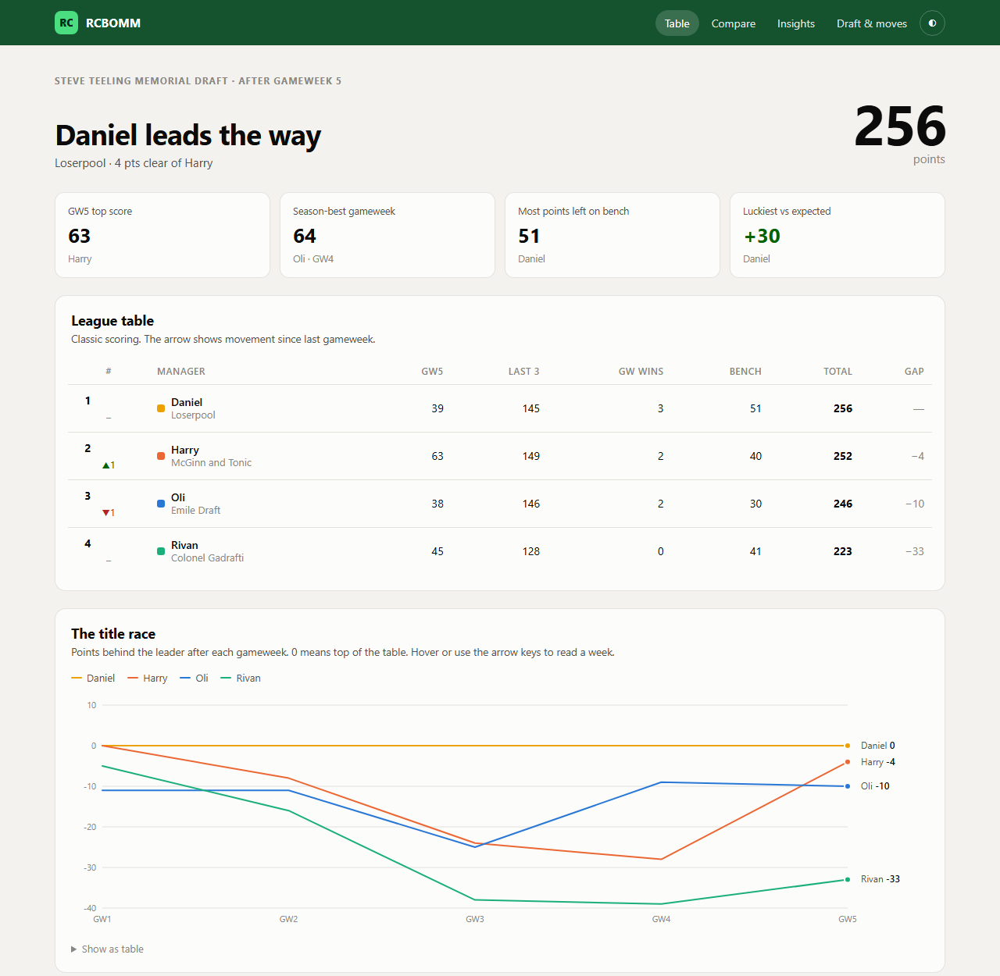
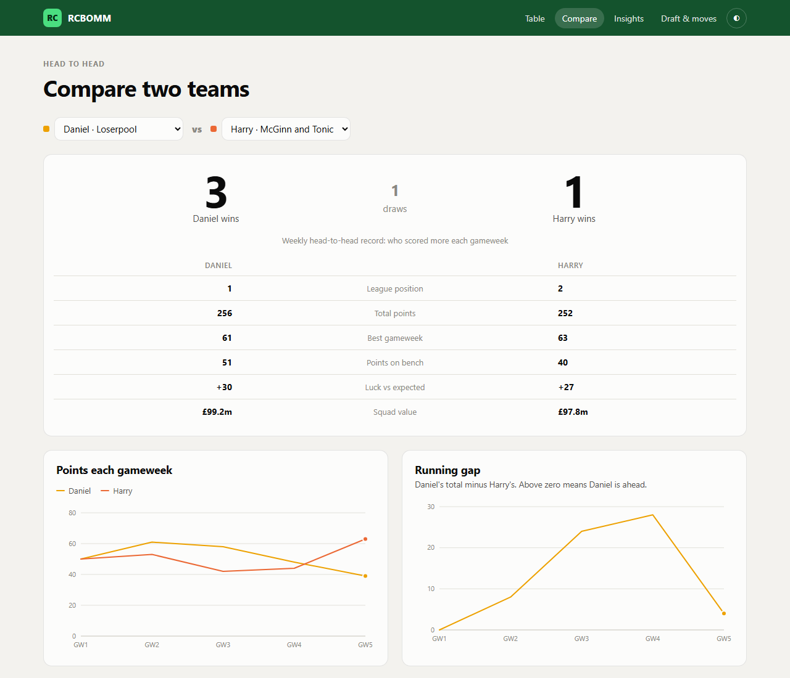
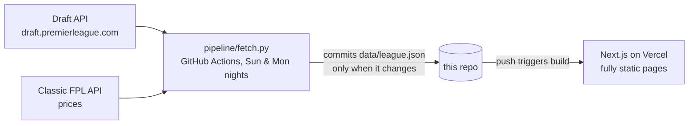

# RCBOMM · Premier League Draft league hub

A stats site for our [Premier League Draft](https://draft.premierleague.com) league: live table, title race,
head-to-head comparisons, manager pages, draft report cards and a "luck" model built on expected goals.



## What's on it

| Page | What it answers |
|---|---|
| **Table** | Who's winning, who's moving, and how the gap to the top has changed week by week |
| **Compare** | Pick any two managers: weekly head-to-head record, running gap, where the points come from, squads side by side |
| **Managers** | One page per team: current squad, top contributors, points by source and position, draft picks, waiver moves |
| **Insights** | Actual vs expected points (luck), bench points, league MVPs, best unowned players, squad value |
| **Draft & moves** | The full draft board scored by points delivered, steals and busts, and the net gain from every waiver pickup |



## How it works



- **No API calls at page-load time.** A GitHub Action runs every Sunday (21:00 UTC) and Monday (23:00 UTC). It runs a Python script that pulls the league, every
  gameweek's live stats and every team's picks, then precomputes everything into one ~60 KB JSON file.
  If nothing changed, it commits nothing, so Vercel doesn't redeploy for nothing.
- **Official scores, verified.** Each team's starting-XI points are rebuilt from player stats and auto-subs, then
  checked against the official gameweek totals.
- **Expected points.** Goals, assists, clean sheets and goals conceded are swapped for their expected-value versions
  (xG, xA, and a Poisson model on xGC); everything else counts as it was scored. Actual minus expected = luck.
- **Draft API has no prices,** so squad values come from the classic FPL API, joined on the player's stable `code`
  (element ids differ between the two games).
- **Charts are hand-built SVG** in React: no chart library, a colour-blind-validated palette where each manager keeps
  the same colour everywhere, hover and keyboard tooltips, a table view, and light and dark themes.

## Run it yourself (for your own league)

```bash
# 1. data (Python 3.10+)
pip install -r pipeline/requirements.txt
LEAGUE_ID=12345 python pipeline/fetch.py      # your league id is in the draft site URL

# 2. site (Node 20+)
npm install
npm run dev                                    # http://localhost:3000
```

To deploy: fork, set a repository **variable** `LEAGUE_ID` (Settings → Secrets and variables → Actions → Variables),
import the repo into [Vercel](https://vercel.com/new), and enable the *Refresh league data* workflow.

## Stack

Python · `requests` · GitHub Actions · Next.js (App Router, static generation) · TypeScript · Vercel

---

Built by [@jonjejunum](https://github.com/jonjejunum). Not affiliated with the Premier League.
